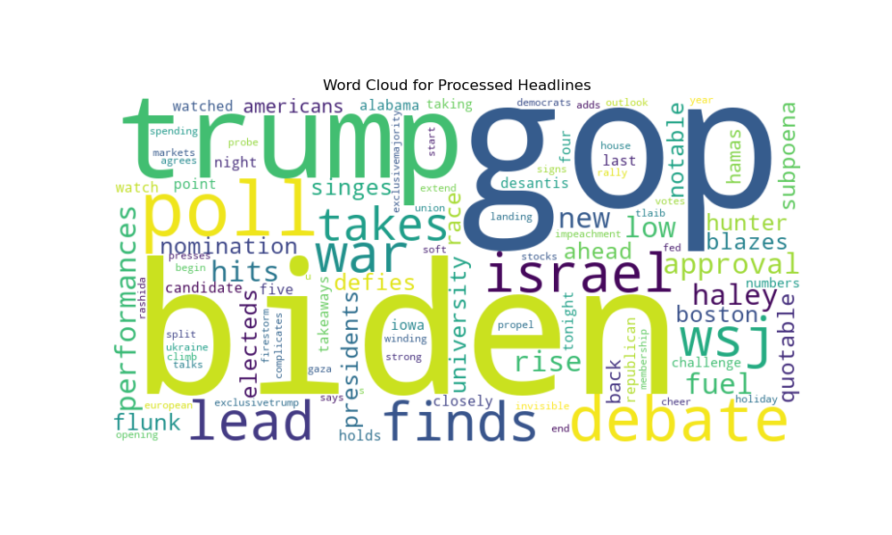

# Media Framing

The media plays a unique role in shaping public opinion and setting the agenda. This project identifies the tone used to report the 2024 U.S. elections in the Wall Street Journal. It is important to examine how the media report relevant events such as elections. Electorates form their judgments about an election based on the information received from the media. Therefore, the overarching question guiding this project is: "How does the media frame the U.S. Elections?"

©2023 
This is an academic project.
