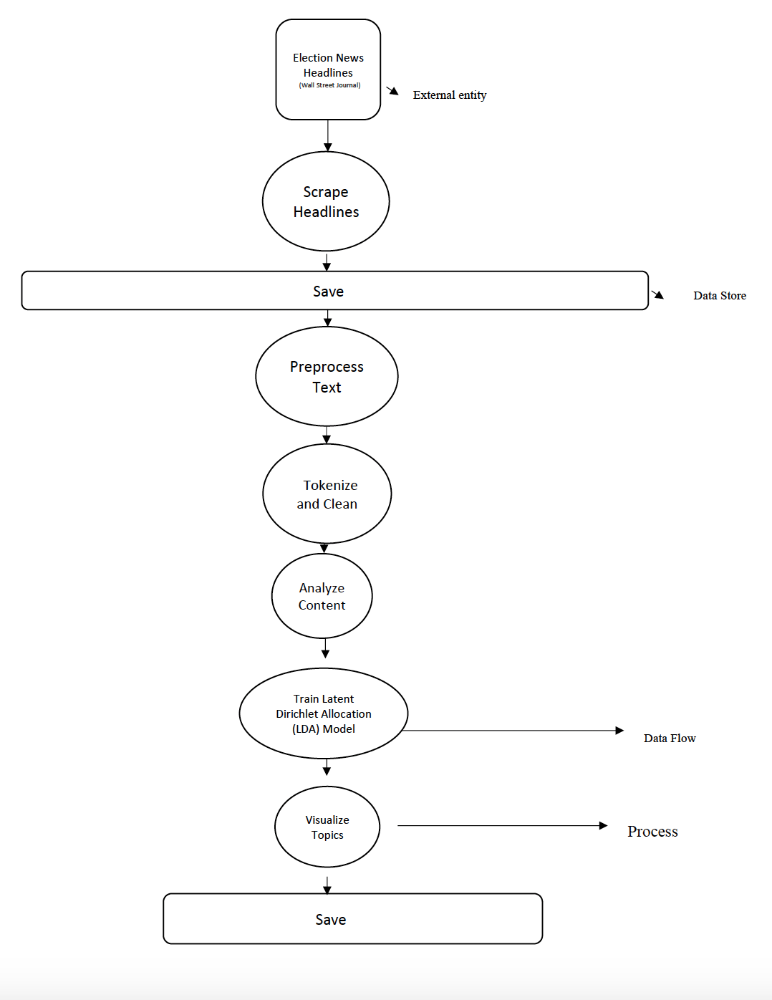

This part of the media framing project documentation contains the major functions used in the six-step process of this project (scrape headlines, process headlines, analyze headlines, topic modeling using the Latent Dirichlet Allocation (LDA) technique, testing the functions created, and visualizing the model output).

# **Functions**

##Step 1: Scrape Headlines  
 `scrape_and_save_headlines`   
This function scrapes headlines from a given URL and saves them to a text file.

##Step 2: Preprocess Text  
 `preprocess_text`  
This function preprocess a given text by tokenizing, removing stopwords, and punctuation.

 `read_headlines_from_file`  
 This function reads headlines from a file.

 `preprocess_and_save_headlines`  
This function preprocess a list of headlines by tokenizing, removing stopwords, and punctuation and save the processed headlines to a text file.

##Step 3: Analyze Content  
 `analyze_content`  
This function analyzes the content of processed headlines and generates a DataFrame with word frequencies.

##Step 4: Train LDA Model  
`train_lda_model`  
This function trains an LDA model using processed headlines.

`save_lda_model`  
This function saves the trained LDA model to a file.

`print_topics`  
This function prints topics and their top words.

##Step 5: Testing  
`TestContentAnalysis`  
This function tests the analyze_content function.

`test_preprocess_text`  
This function tests the preprocess_text function.

`test_lda_model`  
This function tests the performance of the LDA model using coherence score.

##Step 6: Visualize   
`visualize_wordcloud`  
This function generates a word cloud and bar graph from the processed headlines.

