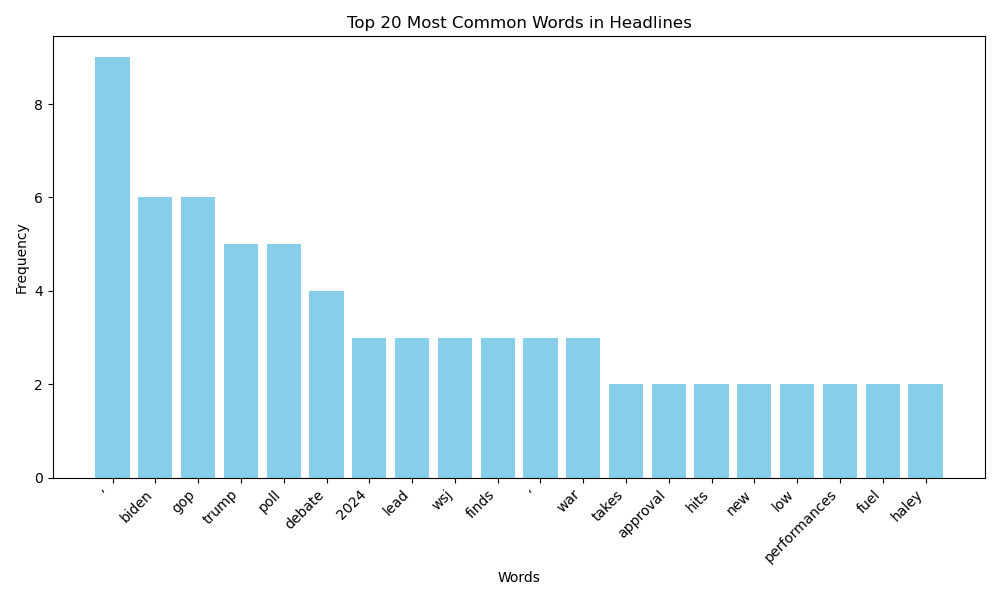

This part of the media framing project documentation contains the visualization derived from the data folder. The main visualization includes the most common words used in the headlines. I plotted some word clouds and bar graphs.

